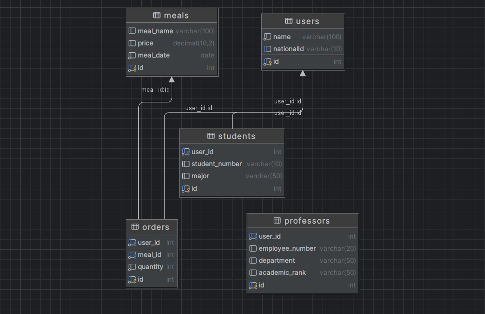

1. جدول users: این جدول اطلاعات پایه کاربران را ذخیره می‌کند، شامل شناسه، نام و شماره ملی که به‌صورت یکتا تعریف شده است.

2. جدول students: این جدول برای ذخیره اطلاعات خاص دانشجویان طراحی شده است و به جدول users با استفاده از کلید خارجی user_id متصل می‌شود. اطلاعاتی مانند شماره دانشجویی و رشته تحصیلی در این جدول قرار دارد.

3. جدول professors: مشابه جدول دانشجویان، این جدول اطلاعات مربوط به اساتید را ذخیره می‌کند و به جدول users با استفاده از کلید خارجی  user_id متصل میشود. این جدول شامل مشخصاتی مانند شماره پرسنلی، دپارتمان و رتبه علمی است.

4. جدول meals: این جدول شامل اطلاعات مربوط به غذاها است، از جمله نام غذا، قیمت و تاریخ مربوط به آن.

5. جدول orders: این جدول سفارشات کاربران را ثبت می‌کند و شامل شناسه کاربر و شناسه غذا به‌همراه تعداد سفارش داده شده است. این جدول با استفاده از کلیدهای خارجی به جداول users و meals متصل می‌شود.

6. 
